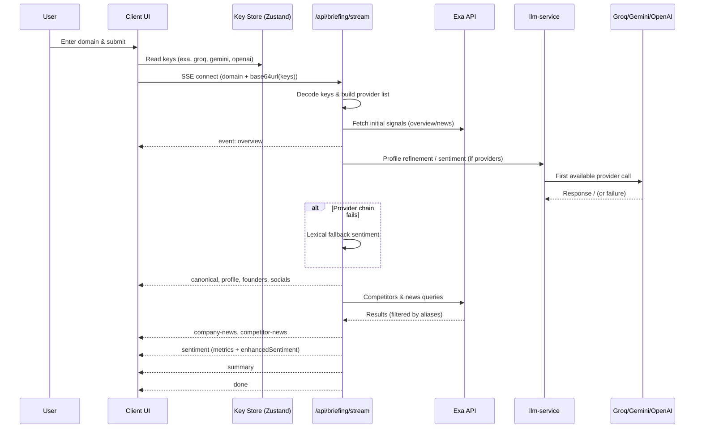

# Exora


Exora streams a VC-grade competitive briefing progressively: instant company overview and founders, followed by canonical enrichment, news, competitor updates, sentiment analytics (with enhanced transparency), and an executive summary. External API calls are globally rate‑limited and can now leverage user-provided API keys (BYOK) for Exa + multiple LLM vendors.

## High-Level Architecture

The system is designed around progressive disclosure, resilience, and pluggable intelligence providers.

Mermaid summarizing the top-level component & service relationships:

```mermaid
flowchart LR
	subgraph Client (Next.js App)
		UI[App Page / React State]\n(SSE Consumer)
		Modal[API Key Modal]\n(BYOK)
		Store[Zustand Store]\n(keys + validation)
		Charts[Sentiment & Benchmarks]
		OverviewCard[CompanyOverviewCard]\n(DQ + AI coverage)
	end

	subgraph Server (API Routes)
		Stream[/api/briefing/stream\nSSE Orchestrator/]
		Batch[/api/briefing (legacy batch)/]
	end

	subgraph Services
		Canonical[canonical inference]
		Profile[profile snapshot + refinement]
		ExaSvc[exa-service]\n(rate-limited)
		LLM[llm-service]\n(dynamic providers)
		Analysis[analysis-service]\n(sentiment,momentum,pulse)
	end

	subgraph External APIs
		Exa[(Exa Search)]
		Groq[(Groq LLM)]
		Gemini[(Gemini LLM)]
		OpenAI[(OpenAI LLM)]
	end

	Modal --> Store
	Store --> UI
	UI -->|Start Stream (domain + encoded keys)| Stream
	Stream --> ExaSvc --> Exa
	Stream --> Canonical
	Stream --> Profile --> LLM
	Stream --> Analysis --> LLM
	LLM --> Groq
	LLM --> Gemini
	LLM --> OpenAI
	Stream --> UI
	ExaSvc --> Analysis
	ExaSvc --> Profile
```

### Progressive Streaming Stages
1. `overview` – Fast TL;DR + bootstrap minimal profile shell.
2. `canonical` – Canonical name + alias inference + industry hint.
3. `profile` – Multi-pass enriched profile (description, headcount heuristics, data quality score).
4. `founders` / `socials` – Leadership & social URLs.
5. `competitors` – Discovered or heuristic competitor domains.
6. `company-news` – Ranked recent high-signal headlines.
7. `competitor-news` – Aggregated peer coverage.
8. `sentiment` – Sentiment, narrative momentum, pulse index, historical synthesis, enhanced sentiment transparency payload.
9. `summary` – Executive bullet points.
10. `done` – Stream completion signal.

### Concurrency & Resilience
* A shared limiter (`lib/limiter.ts`) caps concurrent external requests (default: 5).
* LLM calls degrade sequentially across user-provided providers, then lexical fallback (deterministic heuristic sentiment + minimal narrative) if none survive.
* News & sentiment scoring integrate alias filtering + query expansion for better recall while reducing false positives.

### BYOK (Bring Your Own Keys)
Users supply API keys locally (never sent to server storage):
* Keys are persisted in `localStorage` via a Zustand `useApiKeyStore` with per‑provider validation state (valid, invalid, validating, unknown).
* On search, present keys are JSON encoded, base64url compressed, and appended as a `keys` query param to the SSE URL.
* The server decodes the payload and dynamically assembles the active provider list. Missing providers are simply skipped.
* Exa key is mandatory; UI gating shows the modal if absent.
* The `CompanyOverviewCard` displays an AI coverage badge (count of validated LLM providers) alongside profile data quality (DQ).

Sequence diagram for a typical streaming request with BYOK:



### Enhanced Sentiment Transparency
The `sentiment` event can include `enhancedSentiment` (overall score, component breakdown, qualitative factors, confidence, method tag). UIs can selectively expose this for power users or debugging.

### Data Quality Scoring
Profile completeness is heuristically scored (`high` / `medium` / `low`) based on presence and richness of core fields (industry, description length, headcount, founders, socials). Shown as a badge.

---

## Why this architecture

- Progressive delivery: Users see value immediately (overview + founders/socials) while deeper analysis loads in the background.
- Global rate limiting: A shared concurrency limiter guarantees no more than 5 external requests run in parallel, preventing API 429s and smoothing load.
- Resilient providers: Exa (news/mentions) + Groq/OpenAI/Gemini (LLMs) with clean fallbacks ensure reliable results.
- Familiar, fast stack: Next.js App Router, React, TypeScript, Tailwind, and Recharts provide great DX and performance.

## Tech stack and rationale

- Next.js (App Router): Serverless API routes and React Server/Client components with great DX, edge-friendly primitives, and streaming support.
- React + TypeScript: Strong typing and component ergonomics for complex UI flow and staged data.
- Tailwind CSS: Rapid iteration for premium, dark-themed UI.
- Recharts: Reliable charts for sentiment, momentum, and pulse comparisons.
- Exa API: High-signal mentions/signals for news; optional NewsAPI fallback available in the standard route.
- Groq/OpenAI/Gemini: LLMs for TL;DR, competitor discovery, sentiment scoring, and summary. We prefer Groq for speed and cost, Gemini for fast summaries, OpenAI as a quality fallback.
- Global Concurrency Limiter: `lib/limiter.ts` enforces a 5-concurrent cap across all external calls.

## Progressive data flow

1. Company Overview (instant): One-sentence TL;DR.
2. Founders + Socials (immediate): Key people and profile links.
3. Company News (early): Top 3 latest relevant headlines for the company.
4. Competitor News (next): Latest 4 headlines across competitors.
5. Sentiment & Metrics (later): Momentum, sentiment, pulse indices for all domains.
6. Executive Summary (last): 3 concise, executive-level insights.

## Backend architecture

- Standard route (batch): `app/api/briefing/route.ts` builds the full briefing response at once (kept for back-compat).
- Streaming route (progressive): `app/api/briefing/stream/route.ts` emits Server-Sent Events (SSE) in stages:
	- `overview`, `founders`, `socials`, `competitors`, `company-news`, `competitor-news`, `sentiment`, `summary`, `done`.
- Rate limiting: `lib/limiter.ts` exposes a shared limiter used by:
	- `lib/exa-service.ts`: all Exa requests
	- `lib/llm-service.ts`: Groq/OpenAI/Gemini calls

## Frontend architecture

- Main page `app/page.tsx` subscribes to SSE and updates the UI per event.
- Overview view: `CompanyOverviewCard` + `NewsFeed` + `CompetitorNews` show progressively.
- Analysis view: Shows `CompetitorBarChart` and charts once `sentiment` arrives; displays loaders otherwise.
- Summary view: Shows TL;DR immediately and fills executive bullets after `summary`.

## Rate limit strategy

- Hard cap: At most 5 concurrent external calls at any moment across the app.
- Batched calls: Competitor news are fetched concurrently but pass through the limiter.
- LLM calls: Always scheduled through the same limiter to avoid spikes.

## Env configuration

Create `.env.local` if you want server defaults (these act as fallbacks when user BYOK keys are not provided):

- `EXA_API_KEY` (server fallback — UI still requires Exa via BYOK if not set)
- `GROQ_API_KEY` (optional fallback)
- `OPENAI_API_KEY` (optional fallback)
- `GEMINI_API_KEY` (optional fallback)
- `NEWS_API_KEY` (optional; used by legacy batch route)

If a user supplies keys via the modal, those override env values for that session’s stream.

## Run locally

- Install deps
- Start dev server

```powershell
# From the exora folder
npm install
npm run dev
```

Open http://localhost:3000 and enter a company domain (e.g., stripe.com).

## Try the streaming route directly

Use your browser’s devtools or curl-like tools to hit:

```
GET /api/briefing/stream?domain=stripe.com
```

You’ll receive events like:

```
event: overview
{ "domain": "stripe.com", "overview": "Stripe is a payments platform..." }
```

## Files of interest

- `app/api/briefing/stream/route.ts` - SSE endpoint, orchestrates staged work.
- `lib/limiter.ts` - Global concurrency limiter.
- `lib/exa-service.ts` - Exa calls, rate-limited.
- `lib/llm-service.ts` - Groq/OpenAI/Gemini calls, rate-limited.
- `app/page.tsx` - Consumes the stream and renders progressively.

## Notes & future improvements

- Add source badges (Exa/NewsAPI) to news cards for transparency.
- Cache competitor discovery per domain to reduce LLM calls.
- Persist partial results to localStorage during streaming for refresh resilience.
- Optional: WebSocket transport for bi-directional interactions; SSE suffices for unidirectional streams.
- SSE key-status echo event (optionally confirm accepted providers early).
- Encrypted at-rest storage for keys using WebCrypto + user passphrase.
- Provider usage counters & soft warnings before quota exhaustion.

---

Built for fast, progressive intelligence with a premium UX.
