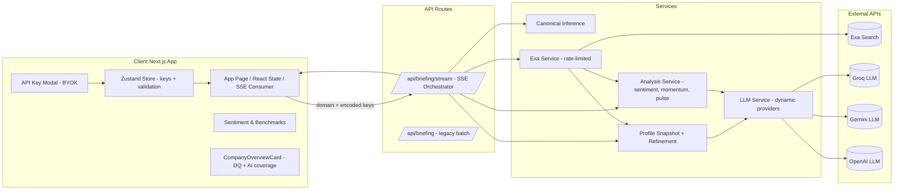

# Exora

<div align="center">
	


*Real-time competitive intelligence scraper powered by Exa search capabilities*

[](https://opensource.org/licenses/MIT)
[](https://nextjs.org/)
[](https://www.typescriptlang.org/)
[](https://tailwindcss.com/)
[](https://recharts.org/)
[](https://exa.com/)
[](https://groq.com/)
[](https://openai.com/)
[](https://www.gemini.com/)

• [🐛 **Report Bug**](https://github.com/AdityaP700/Exora-task/issues) • [**Request Feature**](https://github.com/AdityaP700/Exora-task/issues)

</div>

---

Exora streams a VC-grade competitive briefing progressively: instant company overview and founders, followed by canonical enrichment, news, competitor updates, sentiment analytics (with enhanced transparency), and an executive summary. External API calls are globally rate‑limited and can now leverage user-provided API keys (BYOK) for Exa + multiple LLM vendors.

<div align="center">
	

	
</div>

---
## High-Level Architecture

The system is designed around progressive disclosure, resilience, and pluggable intelligence providers.

Mermaid summarizing the top-level component & service relationships:



### Progressive Streaming Stages
1. `overview` – Fast TL;DR + bootstrap minimal profile shell.
2. `canonical` – Canonical name + alias inference + industry hint.
3. `profile` – Multi-pass enriched profile (description, headcount heuristics, data quality score).
4. `founders` / `socials` – Leadership & social URLs.
5. `competitors` – Discovered or heuristic competitor domains.
6. `company-news` – Ranked recent high-signal headlines.
7. `competitor-news` – Aggregated peer coverage.
8. `sentiment` – Sentiment, narrative momentum, pulse index, historical synthesis, enhanced sentiment transparency payload.
9. `summary` – Executive bullet points.
10. `done` – Stream completion signal.

### Concurrency & Resilience
* A shared limiter (`lib/limiter.ts`) caps concurrent external requests (default: 5).
* LLM calls degrade sequentially across user-provided providers, then lexical fallback (deterministic heuristic sentiment + minimal narrative) if none survive.
* News & sentiment scoring integrate alias filtering + query expansion for better recall while reducing false positives.

### BYOK (Bring Your Own Keys)
<div align="center">
	

</div>
Users supply API keys locally (never sent to server storage):
* Keys are persisted in `localStorage` via a Zustand `useApiKeyStore` with per‑provider validation state (valid, invalid, validating, unknown).
* On search, present keys are JSON encoded, base64url compressed, and appended as a `keys` query param to the SSE URL.
* The server decodes the payload and dynamically assembles the active provider list. Missing providers are simply skipped.
* Exa key is mandatory; UI gating shows the modal if absent.
* The `CompanyOverviewCard` displays an AI coverage badge (count of validated LLM providers) alongside profile data quality (DQ).

Sequence diagram for a typical streaming request with BYOK:


### Enhanced Sentiment Transparency
<div align="center">
	

</div>
The `sentiment` event can include `enhancedSentiment` (overall score, component breakdown, qualitative factors, confidence, method tag). UIs can selectively expose this for power users or debugging.

### Data Quality Scoring
Profile completeness is heuristically scored (`high` / `medium` / `low`) based on presence and richness of core fields (industry, description length, headcount, founders, socials). Shown as a badge.

---

## Why this architecture

- Progressive delivery: Users see value immediately (overview + founders/socials) while deeper analysis loads in the background.
- Global rate limiting: A shared concurrency limiter guarantees no more than 5 external requests run in parallel, preventing API 429s and smoothing load.
- Resilient providers: Exa (news/mentions) + Groq/OpenAI/Gemini (LLMs) with clean fallbacks ensure reliable results.
- Familiar, fast stack: Next.js App Router, React, TypeScript, Tailwind, and Recharts provide great DX and performance.

```mermaid
flowchart TD
    %% Frontend
    A[Next.js App] -->|SSE /api/briefing/stream| B[Streaming UI Components]
    B --> B1[Overview: Company & Founders]
    B --> B2[News Feed & Competitor News]
    B --> B3[Analysis: Charts & Metrics]
    B --> B4[Summary: Executive Insights]

    %% Backend
    A -->|Batch /api/briefing| C[Batch REST Endpoint ]
    C -->|Validate Domain| D[AI Bouncer]
    C -->|Competitor Discovery| E[Groq/OpenAI/Gemini]
    C -->|Fetch Mentions & News| F[Exa Service / NewsAPI Fallback]
    C -->|Compute Metrics| G[Analysis Service]
    C -->|Generate Summary| H[Executive Summary Service]

    %% Streaming flow
    A -->|SSE /api/briefing/stream| I[Streaming Endpoint]
    I --> J[Emit Stages]
    J --> J1[overview]
    J --> J2[founders]
    J --> J3[socials]
    J --> J4[competitors]
    J --> J5[company-news]
    J --> J6[competitor-news]
    J --> J7[sentiment + metrics]
    J --> J8[summary]
    J --> J9[done]

    %% Services & Utilities
    F --> K[Rate Limiter ]
    E --> K
    G --> K
    F -->|Normalize Dates & Deduplicate| L[Utils ]
    G --> M[Sentiment & Momentum Calculations]
    H --> N[Fallbacks & Super Prompt]

    %% Data Contracts
    J --> O[Types: BriefingResponse, BenchmarkMatrixItem, NewsItem, EventLogItem]

    %% Edge Cases
    D --> P[Invalid Domain Handling]
    F --> Q[Empty Exa Results → NewsAPI Fallback]
    G --> R[Sparse Data → Default Metrics]
    E --> S[LLM Failures → Safe Fallbacks]

    %% Notes
    style A fill:#1f2937,stroke:#ffffff,color:#ffffff
    style B fill:#111827,stroke:#ffffff,color:#ffffff
    style C fill:#111827,stroke:#ffffff,color:#ffffff
    style I fill:#1f2937,stroke:#ffffff,color:#ffffff
    style K fill:#374151,stroke:#ffffff,color:#ffffff
    style L fill:#374151,stroke:#ffffff,color:#ffffff
    style M fill:#4b5563,stroke:#ffffff,color:#ffffff
    style N fill:#4b5563,stroke:#ffffff,color:#ffffff
    style O fill:#6b7280,stroke:#ffffff,color:#ffffff
    style P fill:#b91c1c,stroke:#ffffff,color:#ffffff
    style Q fill:#b91c1c,stroke:#ffffff,color:#ffffff
    style R fill:#b91c1c,stroke:#ffffff,color:#ffffff
    style S fill:#b91c1c,stroke:#ffffff,color:#ffffff
```

## Tech stack and rationale

- Next.js (App Router): Serverless API routes and React Server/Client components with great DX, edge-friendly primitives, and streaming support.
- React + TypeScript: Strong typing and component ergonomics for complex UI flow and staged data.
- Tailwind CSS: Rapid iteration for premium, dark-themed UI.
- Recharts: Reliable charts for sentiment, momentum, and pulse comparisons.
- Exa API: High-signal mentions/signals for news; optional NewsAPI fallback available in the standard route.
- Groq/OpenAI/Gemini: LLMs for TL;DR, competitor discovery, sentiment scoring, and summary. We prefer Groq for speed and cost, Gemini for fast summaries, OpenAI as a quality fallback.
- Global Concurrency Limiter: `lib/limiter.ts` enforces a 5-concurrent cap across all external calls.

## Progressive data flow

1. Company Overview (instant): One-sentence TL;DR.
2. Founders + Socials (immediate): Key people and profile links.
3. Company News (early): Top 3 latest relevant headlines for the company.
4. Competitor News (next): Latest 4 headlines across competitors.
5. Sentiment & Metrics (later): Momentum, sentiment, pulse indices for all domains.
6. Executive Summary (last): 3 concise, executive-level insights.

## Backend architecture

- Standard route (batch): `app/api/briefing/route.ts` builds the full briefing response at once (kept for back-compat).
- Streaming route (progressive): `app/api/briefing/stream/route.ts` emits Server-Sent Events (SSE) in stages:
	- `overview`, `founders`, `socials`, `competitors`, `company-news`, `competitor-news`, `sentiment`, `summary`, `done`.
- Rate limiting: `lib/limiter.ts` exposes a shared limiter used by:
	- `lib/exa-service.ts`: all Exa requests
	- `lib/llm-service.ts`: Groq/OpenAI/Gemini calls

## Frontend architecture

- Main page `app/page.tsx` subscribes to SSE and updates the UI per event.
- Overview view: `CompanyOverviewCard` + `NewsFeed` + `CompetitorNews` show progressively.
- Analysis view: Shows `CompetitorBarChart` and charts once `sentiment` arrives; displays loaders otherwise.
- Summary view: Shows TL;DR immediately and fills executive bullets after `summary`.

## Rate limit strategy

- Hard cap: At most 5 concurrent external calls at any moment across the app.
- Batched calls: Competitor news are fetched concurrently but pass through the limiter.
- LLM calls: Always scheduled through the same limiter to avoid spikes.

## Env configuration

Create `.env.local` if you want server defaults (these act as fallbacks when user BYOK keys are not provided):

- `EXA_API_KEY` (server fallback — UI still requires Exa via BYOK if not set)
- `GROQ_API_KEY` (optional fallback)
- `OPENAI_API_KEY` (optional fallback)
- `GEMINI_API_KEY` (optional fallback)
- `NEWS_API_KEY` (optional; used by legacy batch route)

If a user supplies keys via the modal, those override env values for that session’s stream.

## Run locally

- Install deps
- Start dev server

```powershell
# From the exora folder
npm install
npm run dev
```

Open http://localhost:3000 and enter a company domain (e.g., stripe.com).

## Try the streaming route directly

Use your browser’s devtools or curl-like tools to hit:

```
GET /api/briefing/stream?domain=stripe.com
```

You’ll receive events like:

```
event: overview
{ "domain": "stripe.com", "overview": "Stripe is a payments platform..." }
```

## Files of interest

- `app/api/briefing/stream/route.ts` - SSE endpoint, orchestrates staged work.
- `lib/limiter.ts` - Global concurrency limiter.
- `lib/exa-service.ts` - Exa calls, rate-limited.
- `lib/llm-service.ts` - Groq/OpenAI/Gemini calls, rate-limited.
- `app/page.tsx` - Consumes the stream and renders progressively.aa
---
## Getting Started

Follow these steps to start contributing to **Exora**:

1. **Fork and clone the repository**:
```bash
git clone https://github.com/<your-username>/Exora-task>.git
cd <repo-name>
````

2. **Install dependencies**:

```bash
npm install
```

3. **Find a genuine bug or enhancement**.
   For valid issues, use a clear naming convention, e.g.:

   * `[UI/UX] :feat` → for a UI/UX feature
   * `[Backend] :fix` → for a backend bug
   * `[Docs] :update` → for documentation improvements

4. **Create a branch** from `development` (never `main`) before making changes.

5. **Submit a Pull Request** following the guidelines below.

---

## Contributor Guidelines

We welcome contributions from the community, including those joining through programs such as **Hector**, **Fetched**, or **Summer of Code**.
Please follow the steps below to ensure smooth collaboration:

### Issues & Bug Reporting

* Before opening a new issue, **search existing issues** to avoid duplicates.
* Use the **issue templates** provided:

  * [] **Bug Report** – for errors, crashes, or unexpected behavior.
  * [] **Feature Request** – for new ideas or enhancements.
  * [] **Security Report** – for vulnerabilities (please report responsibly).
* Add clear reproduction steps, expected vs. actual results, and screenshots/logs if possible.

### Branch & Commit Practices

* Always branch from `development` (never directly from `main`).
* Use the following branch naming convention:

  * `feat/<short-feature-name>` → for new features
  * `fix/<short-bug-title>` → for bug fixes
  * `docs/<update-area>` → for documentation changes
* Keep commits **atomic** and meaningful. Example:

  * ✅ `fix: resolve duplicate competitor domains`
  * ✅ `feat: add contributor guidelines section`

---

## Running Tests

Before submitting a PR, run tests locally:

```bash
npm run test
npm run lint
```
---

### Pull Requests

* Ensure your PR title follows the format:

  * `[Feature] Add <feature>` / `[Fix] Resolve <issue>`
* Link the related issue (`Closes #123`) inside your PR description.
* Follow the template and checklist to make reviews smoother.
* PRs are merged into `development` first, then promoted to `main` after review & testing.

## Notes & Future Improvements

* Add source badges (Exa/NewsAPI) to news cards for transparency.
* Cache competitor discovery per domain to reduce LLM calls.
* Persist partial results to localStorage during streaming for refresh resilience.
* Optional: WebSocket transport for bi-directional interactions; SSE suffices for unidirectional streams.
* SSE key-status echo event (optionally confirm accepted providers early).
* Encrypted at-rest storage for keys using WebCrypto + user passphrase.
* Provider usage counters & soft warnings before quota exhaustion.

##  Special Thanks

Thanks to everyone contributing under open-source summer programs.
Your work drives the progress of **Exora** 

---

### Contributor Wall

We deeply appreciate every contributor. Your GitHub profile will be displayed in our contributor section below 👇

<a href="https://github.com/AdityaP700/Exora-task/graphs/contributors">
  
</a>


---

Built for fast, progressive intelligence with a premium UX.
