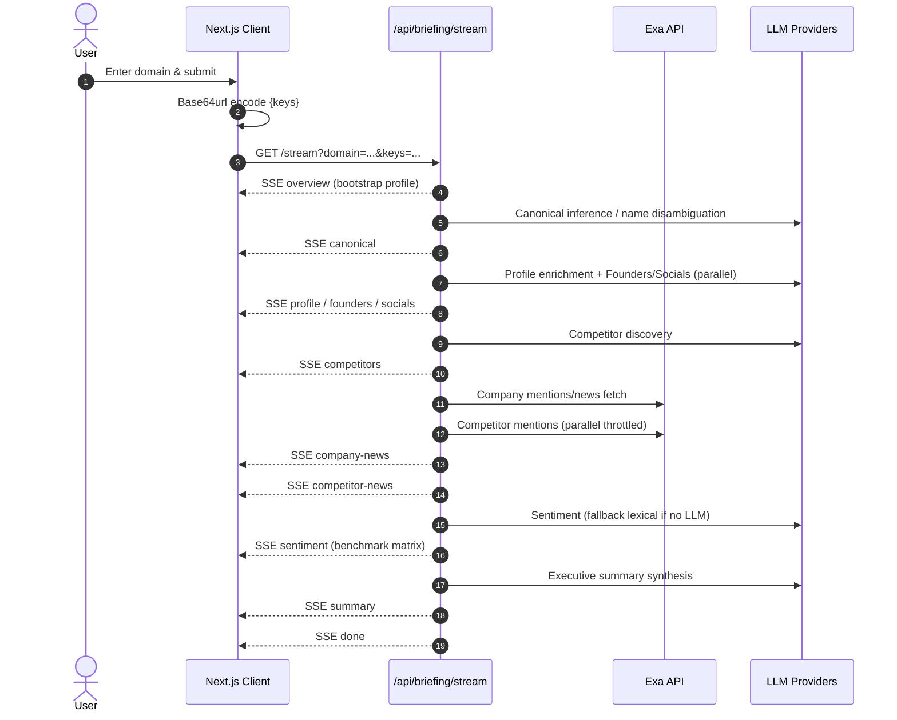

# Exora Competitive Intelligence Dashboard

Real‑time competitive & sentiment briefing for any company domain. Paste a domain (e.g. `stripe.com`) and Exora streams a staged multi‑source analysis: overview → canonical/aliases → enriched profile → founders & socials → competitors → company news → competitor news → sentiment & momentum → executive summary.

---
## ✨ Core Features
- Progressive Server‑Sent Events (SSE) pipeline (fast first byte)
- Bring Your Own Keys (BYOK) for Exa + optional LLM providers (Groq / Gemini / OpenAI)
- Deterministic sentiment fallback when no LLM keys supplied
- Canonical name + alias inference & query expansion
- Competitor discovery + cross‑peer news aggregation
- Narrative Momentum & Pulse Index metrics
- Enhanced sentiment transparency structure (opt‑in)
- Data quality heuristics for profile enrichment

---
## 🧱 High‑Level Architecture
```
Next.js (App Router)
├─ /app/page.tsx (client orchestrator: input, SSE consumer, state merge)
├─ /app/api/briefing/stream/route.ts (Node runtime SSE producer)
├─ /lib/* (analysis-service, exa-service, llm-service, profile-snapshot, canonical, utils)
├─ /components/* (sentiment cards, overview, news, charts, ui primitives)
└─ Zustand key store (BYOK) + modal (api-key-modal)
```

### Data / Control Flow Overview
1. User enters a domain → `handleSearch()` normalizes & validates → opens `EventSource` with optional base64url encoded key bundle.
2. Server route decodes keys and builds `llmProviders[]` dynamically (may be empty).
3. SSE Stages emit incrementally; client merges state with idempotent + diff‑guarded logic.

### Mermaid Sequence Diagram


### Stage Breakdown
| Stage | Event | Purpose | External Calls |
|-------|-------|---------|----------------|
| 0 | `canonical` | Name/alias/industry hint | LLM (optional) |
| 1 | `overview` | Fast TL;DR / first paint | LLM (optional) |
| 2a | `profile` | Structured snapshot enrichment | LLM (optional) |
| 2b | `founders` / `socials` | Leadership & socials | LLM (optional) |
| 3 | `competitors` | Top 3 peer domains | LLM (optional) |
| 4a | `company-news` | Ranked domain news | Exa (mentions + expansions) |
| 4b | `competitor-news` | Cross‑peer news | Exa (parallel) |
| 5 | `sentiment` | Benchmark momentum & sentiment | LLM or lexical fallback + Exa data already fetched |
| 6 | `summary` | Executive bullet synthesis | LLM (optional) |
| 7 | `done` | Stream closure | — |

---
## 🔑 BYOK (Bring Your Own Keys)
Client encodes present keys as base64url JSON: `{ exa, groq, gemini, openai }` → query param `keys`. Server decodes and constructs provider configs. If no LLM keys, sentiment falls back to lexical heuristic; all other LLM prompts are attempted but degrade gracefully.

### Why BYOK?
- User retains billing + quota control
- Zero server storage of secrets (lives only in memory/client state)
- Flexible multi‑provider experimentation

### Key Validation & CORS
Previously Exa key validation happened directly from the browser which could trigger CORS blocks (not all Exa endpoints send permissive CORS headers, and some privacy / shield modes in browsers are stricter). Validation now proxies through a lightweight server route: `POST /api/exa/validate` → performs a minimal 1‑result test query server‑side and returns `{ valid, status, error? }`. The client never calls Exa directly for validation, eliminating:
1. CORS inconsistencies between Chrome/Brave (esp. Incognito).
2. Exposure of validation traffic patterns to the user’s network tools.
3. Potential future tightening of Exa browser access policies.

If you copy this pattern for other providers, prefer server validation when:
- The provider does not guarantee stable CORS headers.
- You need to normalize heterogeneous error formats.
- You want to throttle/aggregate validations (e.g. batch endpoint).

---
## 📊 Rate Limit & Call Strategy
| Provider | Calls per Search (Approx) | Notes |
|----------|---------------------------|-------|
| Exa | 1 primary mentions + up to 3 expansion queries (conditional low recall) + 1 per competitor (≤3) | Parallel competitor fetch. Expansion only if results < threshold. |
| Groq/Gemini/OpenAI (LLM) | 6–10 prompts (canonical, overview/profile, founders+socials (2), competitors, sentiment, summary, optional expansion prompts, validation) | Skips or reduces if data already sufficient or provider keys absent. |

Adaptive heuristics avoid unnecessary prompts (e.g., skip canonical override if name already specific; skip expansion if news volume acceptable).

> NOTE: Actual provider rate limits vary; users should provision sufficient quotas. Exa usage is billed directly against the provided key.

---
## 🧠 Sentiment & Metrics
- Sentiment: LLM numeric extraction 0–100, fallback lexical scoring with polarity scaling + volume nuance
- Narrative Momentum: Temporal + topical recency weighting
- Pulse Index: Composite (momentum + sentiment)
- Enhanced Sentiment (optional): Structured rationale object (gated by env flag)

---
## 🧩 Data Quality & Canonicalization
Canonical inference guides alias filtering, disambiguates homonyms, and drives expansion queries. Data quality scoring influences which profile fields overwrite earlier partial data.

---
## 🚦 Error / Degradation Paths
| Scenario | Behavior |
|----------|----------|
| Missing Exa key | Client prompts user; stream blocked |
| Missing LLM keys | Fallback lexical sentiment; partial profile heuristics |
| LLM parse failure | Retry light text parse; else ignore & continue |
| News low recall | Query expansion + rescoring; fallback to unfiltered original |

---
## 🛡️ Security & Privacy
- Keys never persisted server-side
- No logging of raw keys
- All enrichment transient per request

## Continuous Integration (CI)

This repository includes a GitHub Actions workflow that runs on push and pull request to enforce quality checks.

- What it runs: dependency install, linter (if present), build/typecheck (if present), and tests (if present).
- Workflow file: `.github/workflows/ci.yml`.

To run the same checks locally use:

```powershell
npm ci
npm run lint    # if present
npm run build   # if present (often performs TypeScript typechecking)
npm test        # if present
```

If any of those scripts are missing the workflow currently uses `--if-present` so CI will not fail solely because a script is not defined. If you'd prefer stricter behavior (fail when scripts are missing), update the workflow to remove `--if-present`.


---
## 🖥️ Local Development
```bash
npm install
npm run dev
# Open http://localhost:3000
```
Add a `.env.local` with any default provider keys if desired.

```
EXA_API_KEY=...
GROQ_API_KEY=...
OPENAI_API_KEY=...
GEMINI_API_KEY=...
```

---
## ⭐ Contributing / Star the Repo
If this project helps you, consider starring it. Feature ideas & PRs welcome.

Repository: https://github.com/AdityaP700/Exora-task

---
## 📄 License
MIT (add LICENSE file if not present).

---
## � Responsive Design
The UI now adapts across breakpoints:
- Sentiment header section switches from two-column flex to stacked on small screens.
- Competitor cards grid: `1 -> 2 -> 3` columns (`sm`, `xl`).
- Overview + news layout reorders so news appears first on narrow viewports.
- Filter pill row in competitor news becomes horizontally scrollable to prevent wrapping overflow.
- Navbar wraps actions on very small widths.
Consider further enhancement with a future compact mode (reduced padding + condensed typography) if targeting very narrow embedded iframes.

---
## �📬 Contact
For questions or collaboration: open an issue or reach out via GitHub profile.

